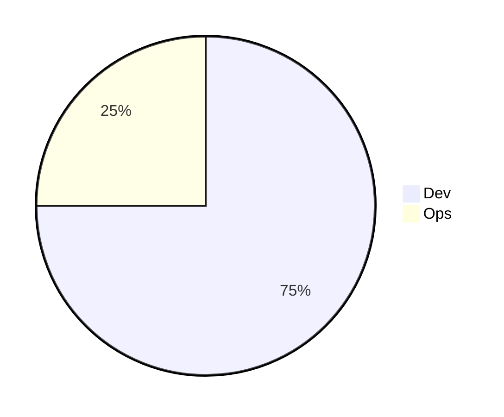
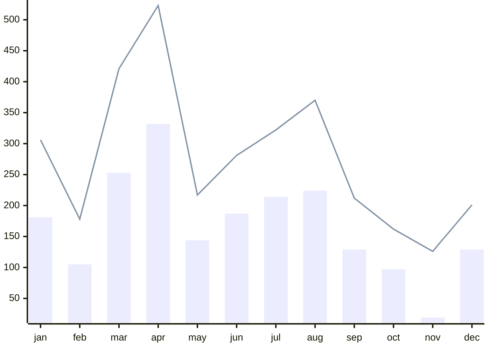

---
# try also 'default' to start simple
theme: seriph
# apply UnoCSS classes to the current slide
class: text-center
# https://sli.dev/features/drawing
#drawings:
#  persist: false
# slide transition: https://sli.dev/guide/animations.html#slide-transitions
transition: slide-left
# enable MDC Syntax: https://sli.dev/features/mdc
mdc: true
---

# 2025年工作总结

PSCM产品部 岩桐

---
layout: center
---
# 工作实绩
---

# 时间分配

---

# 开发任务

|      |                 |
|------|-----------------|
| 一月   | 采购在途-在途占用       |
| 二月   | 物料进度跟踪          |
| 三月   | 电子契约接入平台        |
| 三月   | 个性化导出配置         |
| 四月   | 对接钉钉、飞书等第三方通知待办 |
| 五、六月 | 全棉时代-供应商准入      |

---

# 开发任务

|     |              |
|-----|--------------|
| 七月  | 全棉时代-e签宝私有云  |
| 八月  | 个人待办手机版、弹窗提醒 |
| 九月  | 业务备注增加@功能    |
| 十月  | 供应商考核        |
| 十一月 | 富德士-大货装箱     |
| 十二月 | 进销存报表        |

---
layout: two-cols-header
---

# Code Review

::left::

::right::

## 开发任务

|       |   
|-------|
| 2000+ | 

## 合并请求

|       |   
|-------|
| 3300+ | 

---
layout: center
---
# 工作计划
---
layout: two-cols-header
---

# 技术方面

::left::

### 简化架构

- 合并模块
- 减少依赖

::right::

### 平滑发布

- 蓝绿部署
- 小步快跑

---

# 产品方面

### 任务驱动

- 所有对系统的修改抽象为任务
- 任务可以由系统、人或AI发起/执行

---
layout: center
class: text-center
---

# 谢谢
